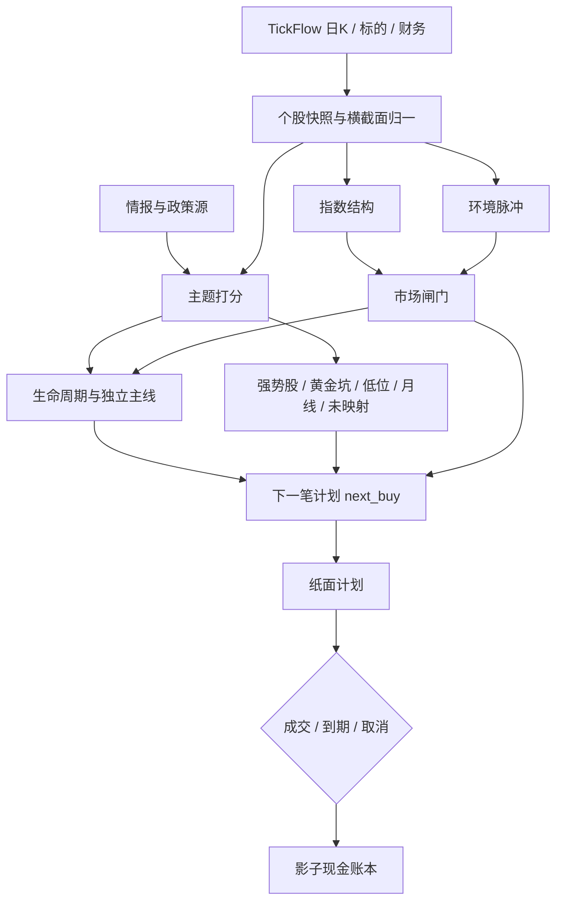

# A 股主线雷达白皮书

A 股主线雷达（A-share Mainline Radar）是一套收盘后研究系统。系统在每个交易日场次内扫描行情、主题篮子、情报与已公告财务，输出市场闸门、主线排名、个股候选、条件化入场计划，以及纸面计划与影子现金账本。

本系统输出研究与雷达材料，不构成投资建议。

## 系统边界

| 项目 | 口径 |
| --- | --- |
| 覆盖市场 | A 股（`.SH` / `.SZ` / `.BJ`）；主题载体可含 ETF |
| 扫描模式 | `curated`：仅配置篮子；`universe`：TickFlow `CN_Equity_A` 全市场，`max_symbols=0` 不截断 |
| 行情周期 | 日 K，`period=1d`，复权 `adjust=forward`；月线箱体另取 `1M`、96 根 |
| 默认回看 | CLI 日线 `lookback-days=180`；强势股历史信号默认持有 15 个交易日 |
| 入场账本 | 仅 `next_buy` 的 `primary` 与 `alternatives` 写入纸面计划 |
| 现金账本 | 独立 10 万人民币影子账户；只消费生产策略纸面事件 |
| 不进入纸面账本 | 黄金坑、低位资金、月线箱体、未映射回踩、涨跌停观察、政策清单 |

ETF（Exchange Traded Fund，交易型开放式指数基金）可出现在主题载体与影子账本中。名称含 `ETF` 或 `基金` 的标的按基金费率计费。

历史截面参数 `as_of`（截至日）按 `YYYY-MM-DD` 截断日线、新闻与财务；缺日期的情报不参与判断。未传入 `--as-of` 时，CLI 使用场次函数 `session_as_of` 的北京时间场次日。

## 处理链路

## 章节索引

| 章节 | 内容 |
| --- | --- |
| [市场闸门](市场闸门) | 红 / 橙 / 绿、硬熔断、允许动作 |
| [主线识别](主线识别) | 主题评分、价格阶段、生命周期、龙头带、情报与政策 |
| [个股筛选](个股筛选) | 强势股、黄金坑、预期差、低位资金、未映射、月线箱体、涨跌停观察 |
| [入场执行](入场执行) | 收盘确认、隔夜限价、次日开盘、T+1、有效期 |
| [纸面与影子账本](纸面与影子账本) | 计划状态、事件、现金账本、伴随卡片 |
| [运行与场次](运行与场次) | Daily cron、并发组、场次窗口 |
| [术语](术语) | 全部术语与状态名 |

源码入口：`ashare_mainline_radar/engine.py` 的 `MainlineRadar.run`。
