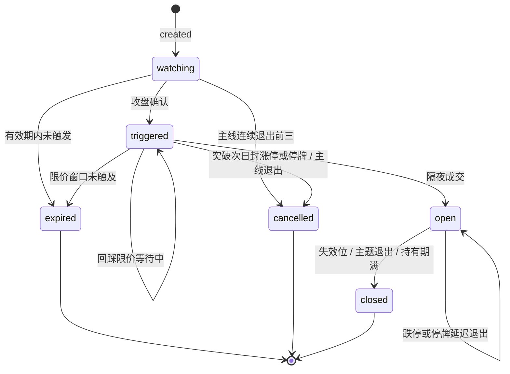

# 纸面与影子账本

纸面计划（paper trade plan）记录条件化研究订单的状态机。影子现金账本（shadow cash-book）是独立的 10 万人民币账户，按整手、费用与 T+1 把生产策略事件兑成现金与持仓。二者分离：`radar_trade_plans.is_shadow` 只标记冻结对照策略，不表示现金账本。

## 策略版本

| 常量 | `strategy_version` | 标签 | `theme_exit_days` | `is_shadow` |
| --- | --- | --- | --- | --- |
| `PRODUCTION_PAPER_STRATEGY` | `mainline-v1-theme-exit-2d` | 生产模拟｜连续2日退出 | 2 | false |
| `FROZEN_EXIT_CHALLENGER` | `mainline-v2-theme-exit-3d-frozen-20260718` | 冻结影子｜连续3日退出 | 3 | true |

每个新信号对上述两个版本各写一条计划。影子现金账本只消费 `strategy_version` 等于生产版本的事件。

## 计划创建

`storage._paper_trade_records` 读取 `next_buy.primary` 与 `alternatives`。必填：代码、名称、主题、收盘、入场模式、买入区、确认价、失效位。`execution_status=triggered` 的卡片不新建计划。`plan_key` 为 `{行情日}:{代码}:{策略版本}`。同代码同策略若已有 `watching` / `triggered` / `open` 计划，不重复插入。

活跃主题集：当日主题榜前三名且状态为 `主线成立` 或 `主线候选`。

## 计划状态

| 状态 | 含义 |
| --- | --- |
| `watching` | 已建计划，等待信号日后的收盘确认 |
| `triggered` | 已确认，工作挂单待下一可成交日成交 |
| `open` | 已按规则成交并持仓 |
| `expired` | 确认窗口或限价窗口结束，未开仓 |
| `cancelled` | 主题失效、次日无法买入等原因取消 |
| `closed` | 已卖出并记录净收益 |

刷新范围：`status in (watching, triggered, open)`。

## 纸面事件

表 `radar_trade_events`，`event_key` 为 `{plan_key}:{event_type}:{event_date}`。

| `event_type` | 时机 |
| --- | --- |
| `created` | 计划入库 |
| `triggered` | 收盘确认，附带工作挂单 |
| `opened` | 买入成交 |
| `expired` | 未触发或限价未成交 |
| `cancelled` | 计划取消 |
| `entry_blocked` | 次日停牌或封涨停（突破市价路径） |
| `exit_delayed` | 卖出日停牌或封跌停 |
| `closed` | 卖出成交 |

## 影子账本

账户单例 `account_id=default`，初始现金与净值 `100_000`。`as_of` 在 `apply_shadow_day` 事务提交成功前保持空；提交成功后推进到当日。若账本 `as_of` 晚于请求日，拒绝回放。同一 `as_of` 已提交则直接读回，不再重跑。

单日顺序：`T+1` 解锁 → 卖出意图 → 买入意图 → 对当日新开仓再处理卖出意图 → 收盘标记。买入意图来自当日生产事件 `opened` / `entry_blocked` / `expired`；卖出意图来自 `closed` / `exit_delayed`，以及持仓上未完成的 `exit_pending_reason`。

| 影子事件 | 含义 |
| --- | --- |
| `fill_buy` / `fill_sell` | 现金成交 |
| `entry_blocked` | 缺 K 线、停牌、封涨停 |
| `expired` | 纸面限价过期，不开仓 |
| `skip_insufficient_cash` | 现金或仓位上限不足一手 |
| `skip_t1` | 当日买入不可卖 |
| `exit_delayed` | 缺 K 线、停牌、封跌停 |
| `mark` | 现金、市值、净值、累计盈亏 |

ETF 可进入影子持仓，按基金费率与滑点计。科创板一手 200 股，其余 100 股。

## 日报运行顺序

`cli.main` 固定顺序：

1. `MainlineRadar.run`（默认 `as_of=session_as_of(现在)`）
2. `refresh_paper_trades`（推进已有计划）
3. `overlay_triggered_working_orders`（已触发卡覆盖等待卡）
4. 写 Markdown / JSON / 雷达飞书卡
5. `persist_report`（新计划入库）
6. `refresh_shadow_account(as_of=report.data_as_of)`
7. 写影子卡；雷达卡先发，影子卡后发

`data_as_of` 取已用日 K 最大时间戳的北京日期。影子刷新使用该日期，与纸面 `event_date` / `last_evaluated_date` 对齐。

## 伴随卡片

雷达作战卡（红色模板）按闸门、主线、下一笔、黄金坑、低位等组织研究结论。影子账户卡（蓝色模板，刷新失败为橙色）展示净值、现金、市值、持仓、工作挂单、今日成交与阻断。影子卡脚注：独立 10 万现金账本，含手续费、手数与 T+1；不代表实盘持仓。

影子 webhook 默认与雷达卡相同，可用 `SHADOW_FEISHU_WEBHOOK_URL` 覆盖。影子状态非 `refreshed` 时不发送影子卡。
